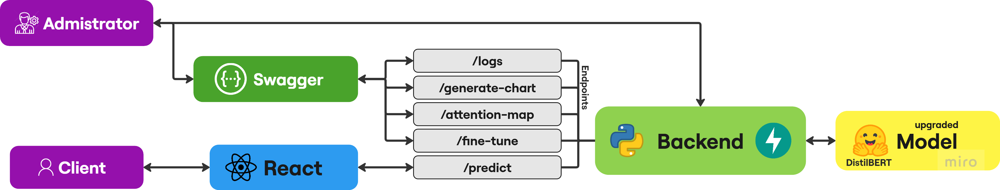

# Fake News Detector

## 📋 Przeznaczenie aplikacji

W dzisiejszych czasach internet i media są pełne treści, które często nie są weryfikowane przed udostępnieniem. Brak
kontroli nad udostępnianiem informacji prowadzi do powstawania mylących wiadomości, rozprzestrzeniania dezinformacji
oraz spadku zaufania do wiarygodnych źródeł informacji.

Nasza aplikacja została stworzona, aby rozwiązać ten problem. Dzięki wykorzystaniu zaawansowanych technologii, takich
jak sieci neuronowe i sztuczna inteligencja, aplikacja umożliwia analizę treści nagłówków wiadomości i ocenę ich
wiarygodności. Użytkownicy mogą szybko sprawdzić, czy dany nagłówek jest zgodny z rzeczywistością, co pozwala ograniczyć
rozpowszechnianie fałszywych informacji i podnieść świadomość społeczną na temat jakości konsumowanych treści.

Fake News Detector jest praktycznym narzędziem zarówno dla zwykłych użytkowników internetu, jak i dla dziennikarzy oraz
organizacji zajmujących się fact-checkingiem.

---

## 🏗️ Struktura aplikacji

Aplikacja składa się z trzech głównych komponentów:

1. **Model** - odpowiada za analize danych wprowadzonych, tworzony jest za pomocą złożonego DistilBERT i natrenowany na
   własnych danych

2. **Backend**
    - Zarządza przepływem danych między modelem a użytkownikiem.
    - Umożliwia administratorom nadzorowanie oraz ulepszanie modelu.

3. **Frontend SPA** - Dostarcza intuicyjny interfejs użytkownika, umożliwiając łatwe korzystanie z funkcji aplikacji.



Dzięki takiej architekturze aplikacja jest modularna, co pozwala na łatwe rozdzielenie funkcjonalności między różnymi
komponentami.

---

## ⚙️ Instrukcja uruchomienia

### Wymagania:

- **React npm** 10.9.1
- **Node.js** 23.3.0
- **Python** 3.9 lub wyższy
- **Git** 2.0 lub wyższy

### Kroki Pobierania:

1. Wybierz odpowiedni folder na Twoim systemie i użyj komendy:  
   `git clone https://github.com/LaneyBlack/SUML_Project.git`
2. Po pobraniu aplikacji przejdź do folderu aplikacji:  
   `cd SUML_Project`

## Automatyczna instalacja (system Linux):

1. Po pobraniu repository instalację można przeprowadzić za pomocą przygotowanego pliku install.sh, który zainstaluje
   automatycznie jak narzędzia (React, pip, Python3 i wszystkie biblioteki) tak i stworzy i natrenuje ML model. Wykonać
   to można za pomocą następującej komendy:
   `.\install.sh`

### Instalacja Backend:

#### Opcja 1 Dockefile

1. Uruchomić część backendową wraz z instalacją wszystkich niezbędnych bibliotek i narzędzi (Python i pip) można za
   pomocą `Dockerfile`, który został przygotowany specjalnie pod taką okazję.

#### Opcja 2 ręczna instalacja

1. Przejdź do folderu backendu:  
   `cd backend`

2. Stwórz wirtualne środowisko Python (venv):  
   `python3 -m venv venv`

3. Zainstaluj wymagane biblioteki:  
   `pip install -r requirements.txt`

4. Aktywuj venv:  
   `source venv/bin/activate`

   Dla windows
   `source venv/Scripts/activate`

5. Uruchom backend aplikacji:  
   `python3 app.py`  
   Aplikacja uruchomi się na lokalnym serwerze pod adresem: `http://localhost:8000/docs` (z użyciem FastAPI).

### Instalacja Frontend:

#### Opcja 1 Posiadając statyczny Web Page (React SPA)

1. Dla uruchomienia części frontendowej za pomocą już przekazanego builda, trzeba tylko skonfigurować chmurę albo serwer
   na potrzebę udostępnienia strony pod otwartym IP. Wykonać to można za pomocą Nginx albo chmurowego rozwiązania (np.
   render.com)
2. Przed uruchomieniem trzeba się upewnić, że plik .env posiada prawidłowy URL do Backendu
   `REACT_APP_BACKEND_URL=http://127.0.0.1:8000`

#### Opcja 2 Za pomocą Source code

1. Przejdź do folderu frontendu:  
   `cd frontend`

2. Instalacja Node.js

   Linux:

   `sudo apt-get install -y nodejs`

   `sudo npm install -g npm`

   Windows:

   Pobrać Node.js LTS (Long-Term Support) z podanej strony internetowej

   https://nodejs.org/en

   Run the `.msi` file.

3. Przed uruchomieniem trzeba się upewnić, że plik .env posiada prawidłowy URL do Backendu
   `REACT_APP_BACKEND_URL=http://127.0.0.1:8000`

4. Aby stworzyć wersję produkcyjną aplikacji React:  
   `npm run build`  
   (Aplikacja będzie gotowa do wdrożenia na serwerze lub hostingu, np. za pomocą Nginx).

5. Aby uruchomić aplikację w trybie deweloperskim:  
   `npm run start`  
   Aplikacja będzie dostępna pod adresem `http://localhost:8080`.

### Deployment na serwerze Nginx (jeśli potrzebne):

1. **Przygotowanie folderu build**:  
   Umieść folder `build` aplikacji front-endowej na serwerze (np. w katalogu: `/opt/fake_news_detector/frontend/build`).

2. **Konfiguracja Nginx**:  
   Skonfiguruj Nginx w następujący sposób, tworząc plik konfiguracyjny:

   `/etc/nginx/sites-enabled/fake_news_detector`:
   ```nginx
   server {
       listen 80;
       server_name 10.40.1.47;

       root /opt/fake_news_detector/frontend/build;
       index index.html;

       location / {
           try_files $uri /index.html;
       }
   }

3. **Przeładować Nginx wprowadzić zmiany w konfiguracje**:
   `sudo systemctl reload nginx`

---

## 🚀 Instrukcja do użycia

### Użycie Backendu:

Jeśli istnieje potrzeba wytrenowania modelu od nowa, administrator może to zrobić w następujący sposób:

1. Przejdź do folderu z modelem:  
   `cd ./backend/model`

2. Uruchom plik, który inicjuje proces tworzenia modelu:  
   `python3 construction.py`

#### Swagger - backend endpoints:

- `GET` `/generate-chart` - umożliwia generację chartu
- `GET` `/logs` - umożliwia przejrzenie zdarzeń na Backendzie
- `GET` `/docs` - umożliwia dostęp do Swagger
- `GET` `/openapi.json` - umożliwia dostęp do dokumentacji endpointów
- `GET` `/redoc` - umożliwia dostęp do API docs by Redocly
- `POST` `/fine-tune` - umożliwia dalsze trenowanie
- `POST` `/predict` - umożliwia predykcje podanego zestawu testów
- `POST` `/attention-map` - umożliwia wygenerowanie attention map dla podanego zestawu tekstu

Logi serwera można przeglądać w pliku **backend.log**, dostępnym pod adresem: `http://localhost:5000/logs`. Plik zawiera
informacje o wykonanych akcjach w formacie:  
`data - treść - akcja`

Do analizy każdego treningu modelu używany jest plik **model_log.json**, który zawiera dane takie jak: loss, grad_norm,
learning_rate, epoch, i step.

### Użycie WWW (User manual):

1. Przejdź na stronę aplikacji: `http://localhost:8080`.
2. W polu tekstowym wpisz treść (minimum 100 znaków).
3. Do wyboru są dwie opcje:
    - **Przycisk "Reset"**: Wyczyści pole tekstowe.
    - **Przycisk "Predict"**: Uruchamia model AI, który ocenia prawdziwość wprowadzonego tekstu.


